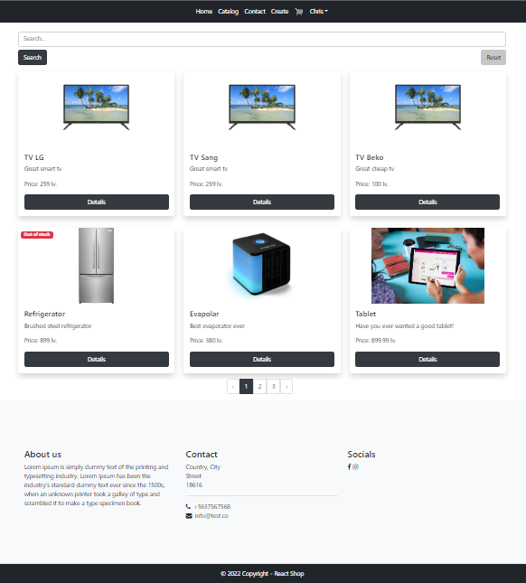
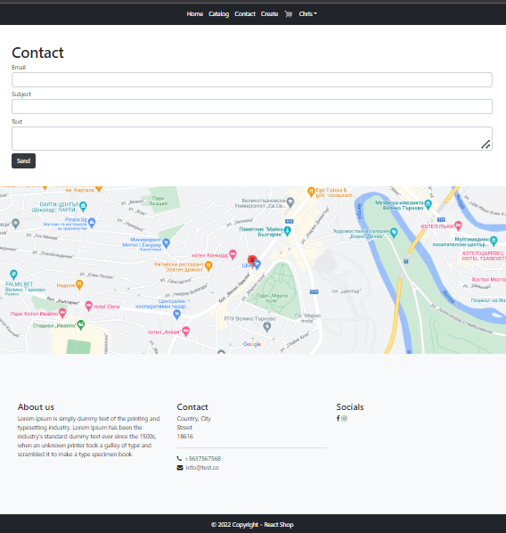
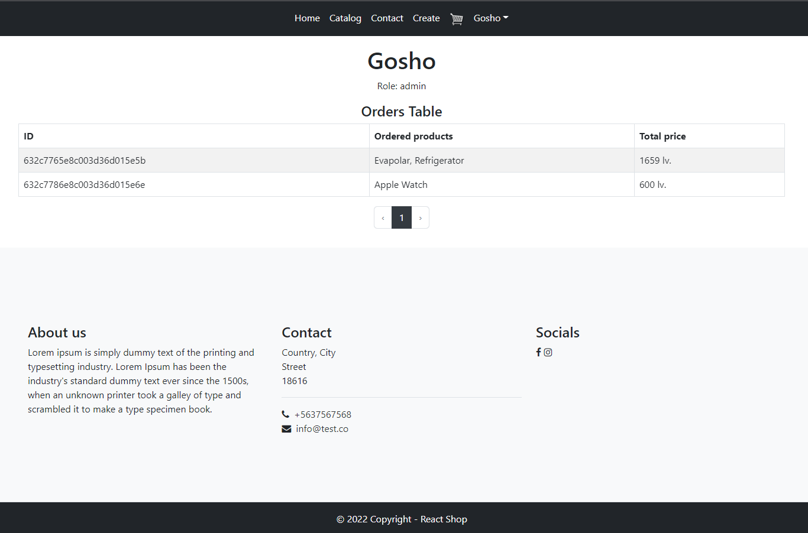
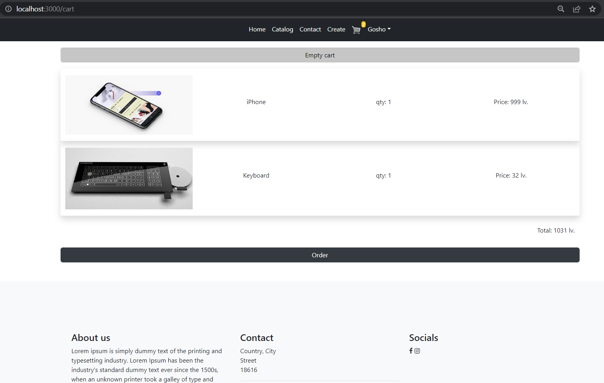
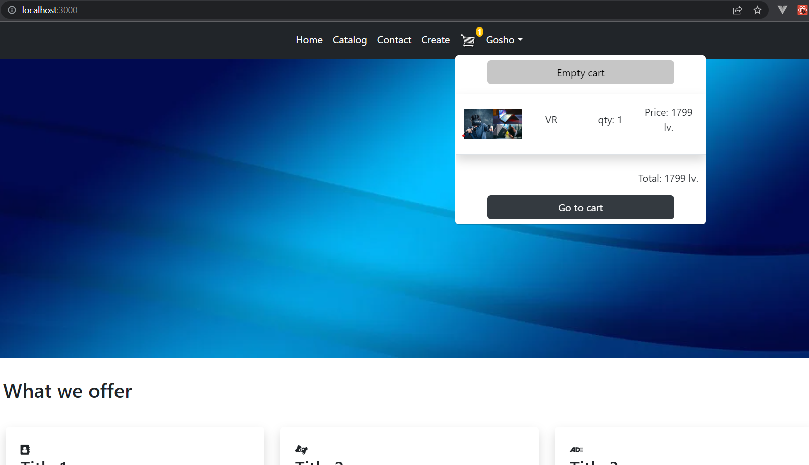

# React Shop

Basic React shop implementation for learning purposes, you can register, login, add to cart, make an order, check user's profile etc.

## How to check it out

Clone the project from this repository. Run `npm install` after that `npm start` and the app will start on [http://localhost:3000](http://localhost:3000) in your browser. 

Initially created users if my API is used:
```
Admin
username: Gosho
pass: 123456
```
```
Normal user
username: Chris
pass: 123456
```

## Tests

Run `npm test` and then press letter `a` to run all tests.

## API

For backend i use my other project [https://github.com/chrisbgvt/ecommerce-api](https://github.com/chrisbgvt/ecommerce-api).

## Sample screenshots






